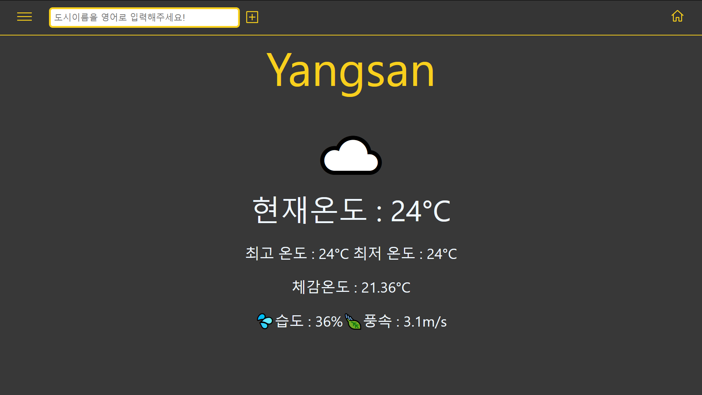
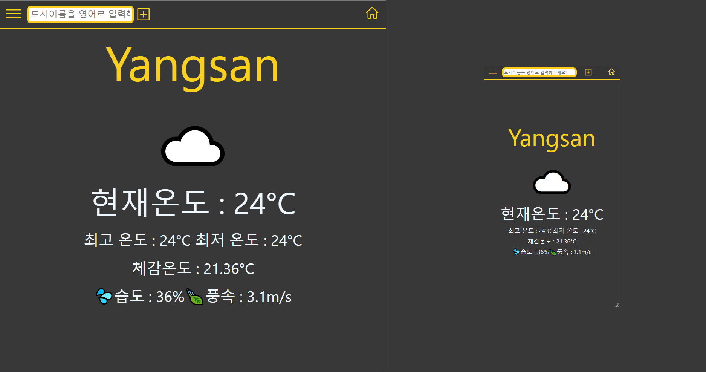

## 간단한 이번 앱 설명

> 이번에 만든앱은 리액트 자체와 리액트 라우터 두 가지를 사용해서 자신의 위치서비스 기반으로 날씨를 조회 해줍니다.
> 앱을 실행하고 localhost:3000 (빌드된 환경은 포트 5000번) 접속을 하면 온도 서비스, 풍속 서비스, 날씨 상태 서비스를 넣어놓았습니다.
> 검색창에 영어로 다른 지역명을 넣고 + 버튼을 누르면 메뉴에 지역 명이 추가가 됩니다. 해당 지역명을 누르면 그 지역의 날씨 정보가 반영되어 나오도록 만들어 보았습니다.
> 컴퓨터, 태블릿, 스마트폰에도 이용할 수 있게끔 미디어쿼리를 적용하였습니다.

## GitHub Pages 배포완료
### https://oct-sky-out.github.io/Weather-project/ 로 이동
## 실행방법

### node_modules의 파일이 너무커서 빠졌습니다.
> 1. git clone
> 2. npm install
> 3. npm run start
> 4. 실행완료

### `npx serve -s build`

> 모의로 실제 배포되는 환경으로 로컬에서 실행시켜준다.
> Open [http://localhost:5000](http://localhost:5000) to view it in the browser.

### `yarn start | npm start (yarn이 없으면 npm start로)`

> 개발환경으로 로컬에서 실행시켜준다.
> Runs the app in the development mode. 
> Open [http://localhost:3000](http://localhost:3000) to view it in the browser.

### 앱 실행 사진

#### 아직 많이 부족해서 혹시 이러한 기능도 넣어줬으면 하시는 분은 이슈를 남겨주세요!
#### 로직도 이상하다 싶은 부분도 남겨주세요!! 배우는 입장에서 감사드립니다!!
#### 개발 후 풀리퀘 남겨놓겠습니다!!!
